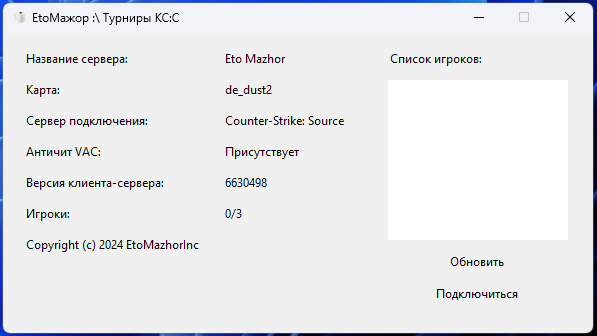

## Приложения для EtoМажор проекта
Приложение максимально простое. Здесь используется минимум технологий. Оно было сделано на скорую руку, но работает. Есть JSON-сервер, который обеспечивает взаимодействие. Последняя версия клиента работает на всех системах. Более полноценную сборку сделаю позже, сейчас нет времени.



## Установка
Если вы хотите установить программу локально, вам понадобится Python версии 3.7. Также потребуется немного умелых рук. Примеры приведены для Windows, но для Linux они почти не отличаются.

**Подготовка окружения для запуска:**
```bash
python -m venv venv
venv/Scripts/activate
pip install -r requirements.txt
```

**Запуск JSON-сервера для получения текущего IP, пароля и прочего:**
```bash
python server_service.py
```

**Развертывание на сервере (требуется tmux):**
```bash
# Создаем сессию
tmux new -s css_service
#   Выйти из сессии можно с помощью
#   комбинации клавиш Ctrl+b, затем
#   ввести detach и нажать Enter

# Возвращение в сессию:
tmux attach-session -t css_service
```

**Запуск приложения локально:**
Если вы хотите запустить приложение на компьютере для тестирования и работы с сервером, выполните:
```bash
# Для обычного запуска с Python:
python window.py
# Для сборки проекта в .exe:
python setup.py build
```

## Лицензия
Лицензия Apache License 2.0. Подписано EtoMazhorInc.
